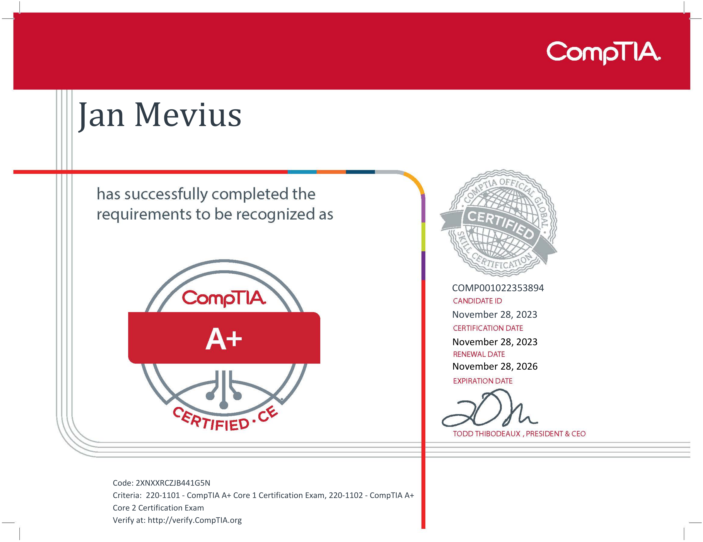
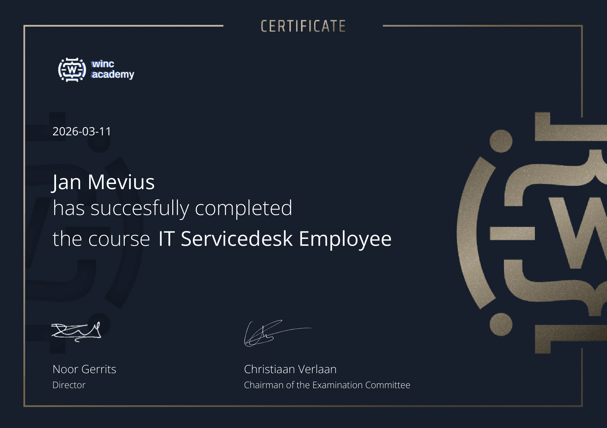
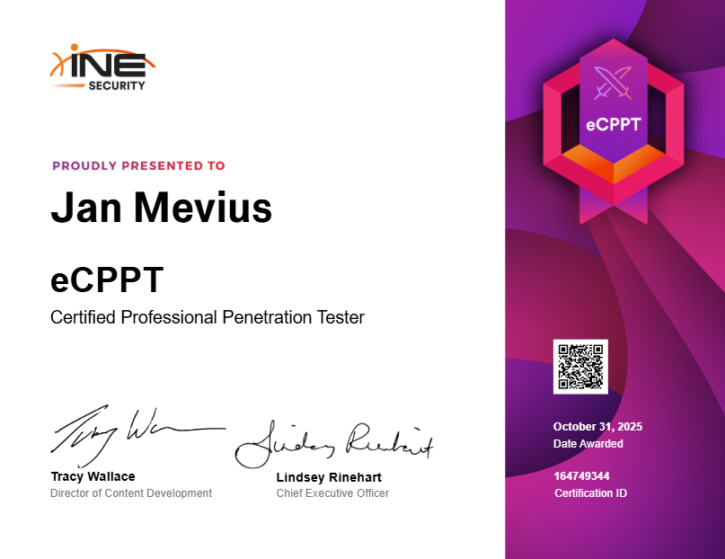
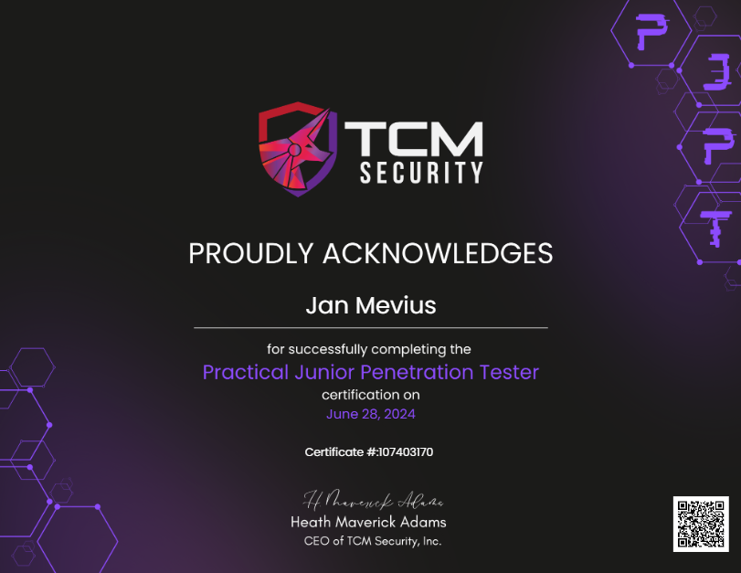
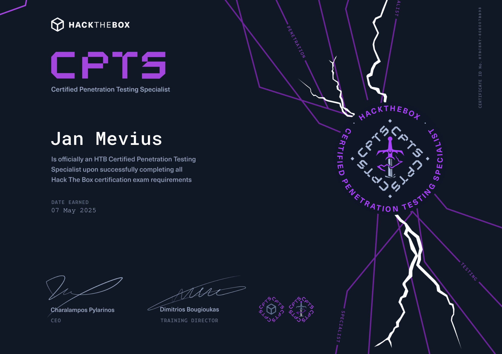

# Certifications

## Comptia A+

[Verification](https://www.credly.com/badges/3ea659dd-3275-4e0d-b036-daa2b3320990/linked_in_profile)

## WincAcademy

[Verification](https://credsverse.com/credentials/b257bb6c-a8eb-41e5-a6eb-442f53a1f0ad)

## ITIL 4 Foundation

[Verification](https://www.peoplecert.org/for-corporations/certificate-verification-service) - Use below info

Cert ID: GR671868194JM

## INE eCPPT

[Verification](https://certs.ine.com/b562b53f-a495-4f60-83a2-995a0c32d2b9#acc.GSXUw2LF)

## TCM PJPT (The Cyber Mentor)

[Verification](https://certified.tcm-sec.com/c30a58ae-bb54-4c0e-8678-3f697df5f103)

## HTB CPTS (HackTheBox)

[Badge](https://academy.hackthebox.com/achievement/badge/3599178d-2b3f-11f0-bcfd-bea50ffe6cb4)

[Verification](https://www.hackthebox.com/certificates) – Use below info  
Full name: Jan Mevius  
Cert ID: HTBCERT-80E007BB98
